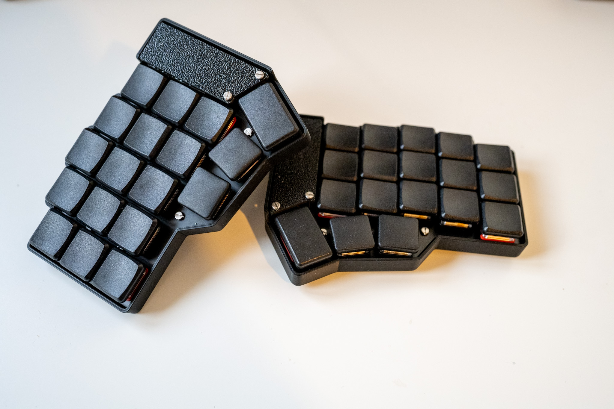

# zmk-config

## Corne White

[Corne Wireless](https://github.com/foostan/crkbd/) 6-column with low-profile Kailh Choc Kevs (pro red & brown tactile)
| Keyboard      | Keymap        |
| ------------- |:-------------:|
|  |  |

## Corne Black

[Corne Wireless](https://github.com/foostan/crkbd/) 5-column with low-profile Kailh Choc Kevs (pro red & brown tactile)

| Keyboard      | Keymap        |
| ------------- |:-------------:|
|  |  |
